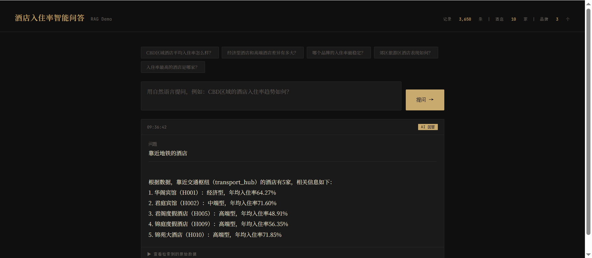

# hotel-rag

[English](README.md) | 简体中文

酒店入住率问答演示 — Python 数据生成 + Go HTTP 服务 + LLM。

支持两种检索模式：关键词检索（默认）和语义向量检索（通过 Qdrant + Jina）。

## 技术栈

| 层   | 技术                         |
| --- | -------------------------- |
| 数据  | Python                     |
| 检索  | 关键词（默认）· Qdrant + Jina（可选） |
| 服务  | Go                         |
| LLM | Claude / DeepSeek / Ollama |

## 快速开始

```bash
# 生成数据
python scripts/gen_data.py

# 配置
cp config.example.yaml config.yaml  # 设置 llm.provider + api_key

# （可选）启用向量检索：启动 Qdrant，然后
JINA_API_KEY=xxx python scripts/gen_embeddings.py
# 在 config.yaml 中设置 qdrant.jina_api_key

# 运行
go mod tidy && go run cmd/server/main.go
# → http://localhost:8080
```

## 关键词检索 vs 向量检索

同一查询: *"靠近地铁的酒店"*

| 关键词检索                                 | 向量检索 (Qdrant + Jina)                        |
| ------------------------------------- | ------------------------------------------- |
|  |  |

关键词检索没有“地铁”字段可匹配，因此只能返回模糊的区域级答案。向量检索可以获取语义相关的记录，并返回具体的酒店列表。

## 评估

检索性能在 20 条查询上进行基准测试，涵盖不同类型的查询：

* 语义查询（例如 "靠近地铁的酒店"）
* 关键词查询（精确匹配）
* 聚合查询
* 时间序列查询
* 比较查询

### 主要发现

* **语义查询中，向量检索明显优于关键词检索**
* **关键词检索在精确匹配查询中仍有竞争力**
* **聚合查询更多依赖结构化摘要而非检索**
* **当缺失必要数据时，两种方法都会失败**

查看完整报告：

👉 [查看评估报告](https://muchen0532.github.io/hotel-rag/eval_results/)


