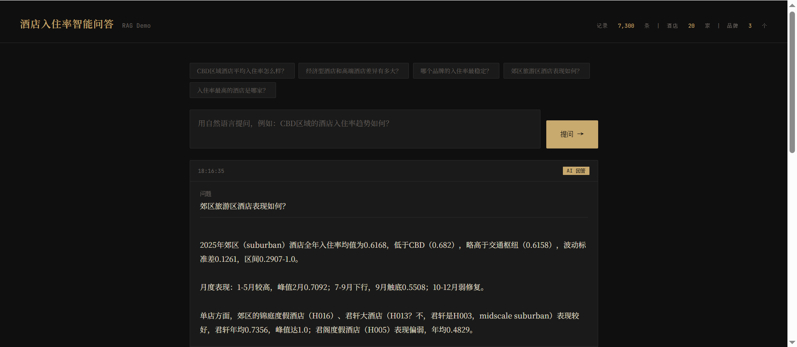

# hotel-rag

Hotel occupancy rate Q&A system based on RAG architecture.

**Stack**: Python (data processing) + Go (HTTP service) + LLM (natural language Q&A)

---

## Architecture

```
scripts/gen_data.py
    ↓ generates
hotel_data.csv + summary.json
    ↓ loaded by
Go service  (retrieval + routing + LLM call)
    ↓ calls
LLM  (understands question + generates answer)
    ↓
User
```

- **Python**: data generation, statistical summary (pandas)
- **Go**: HTTP service, keyword retrieval, LLM integration
- **LLM**: supports Claude / DeepSeek / Ollama (factory pattern, switch via config)

---

## Project Structure

```
hotel-rag/
├── cmd/server/main.go          # entry point
├── internal/
│   ├── config/config.go        # config loader
│   ├── db/vectordb.go          # CSV loader + keyword retrieval
│   ├── llm/
│   │   ├── llm.go              # Client interface
│   │   ├── factory.go          # factory: returns provider by config
│   │   ├── claude.go           # Claude implementation
│   │   ├── deepseek.go         # DeepSeek implementation
│   │   └── ollama.go           # Ollama implementation (local, free)
│   └── handler/handler.go      # HTTP handlers
├── scripts/
│   └── gen_data.py             # generates hotel_data.csv + summary.json
├── index.html                  # frontend
├── config.example.yaml         # config template
├── config.yaml                 # real config (git ignored)
└── go.mod
```

---

## Quick Start

### 1. Clone & configure

```bash
git clone git@github.com:your-username/hotel-rag.git
cd hotel-rag
cp config.example.yaml config.yaml
# edit config.yaml: set provider and api_key
```

### 2. Generate data

```bash
pip install pandas numpy
python scripts/gen_data.py
# outputs: hotel_data.csv, summary.json
```

### 3. Start service

```bash
go mod tidy
go run cmd/server/main.go
```

Open http://localhost:8080

---

## Switch LLM Provider

Edit `config.yaml`, restart service:

```yaml

# Ollama (local, free)
llm:
  provider: "ollama"
  base_url: "http://localhost:11434"
  api_key: ""
  model: "qwen2.5:7b"
```

To add a new provider: implement the `llm.Client` interface, add one `case` in `factory.go`.

---

## Example Questions

- What is the occupancy trend for CBD hotels?
- How big is the gap between economy and premium hotels?
- Which brand has the most stable occupancy rate?
- How did the hotels perform during the Spring Festival?
- Which district has the highest occupancy?

---

## How It Works

Each query sends two types of context to the LLM:

1. **Global summary** (`summary.json`): pre-computed statistics by brand / district / month, generated by pandas from the full dataset
2. **Retrieved records**: top-K records matched by keyword from the in-memory CSV

This ensures aggregation questions (trends, comparisons) are answered from full-dataset statistics, while specific queries (a single hotel, a specific date) are answered from retrieved records.


---

## Demo

